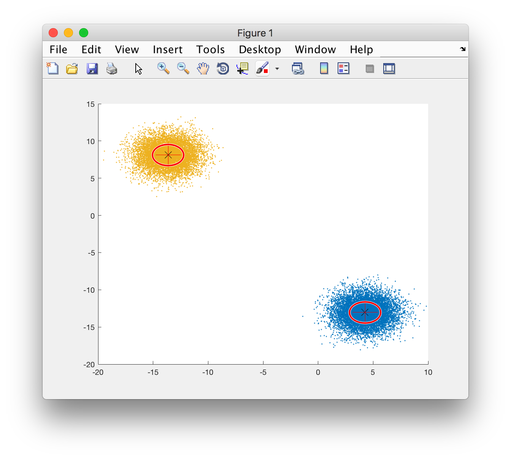
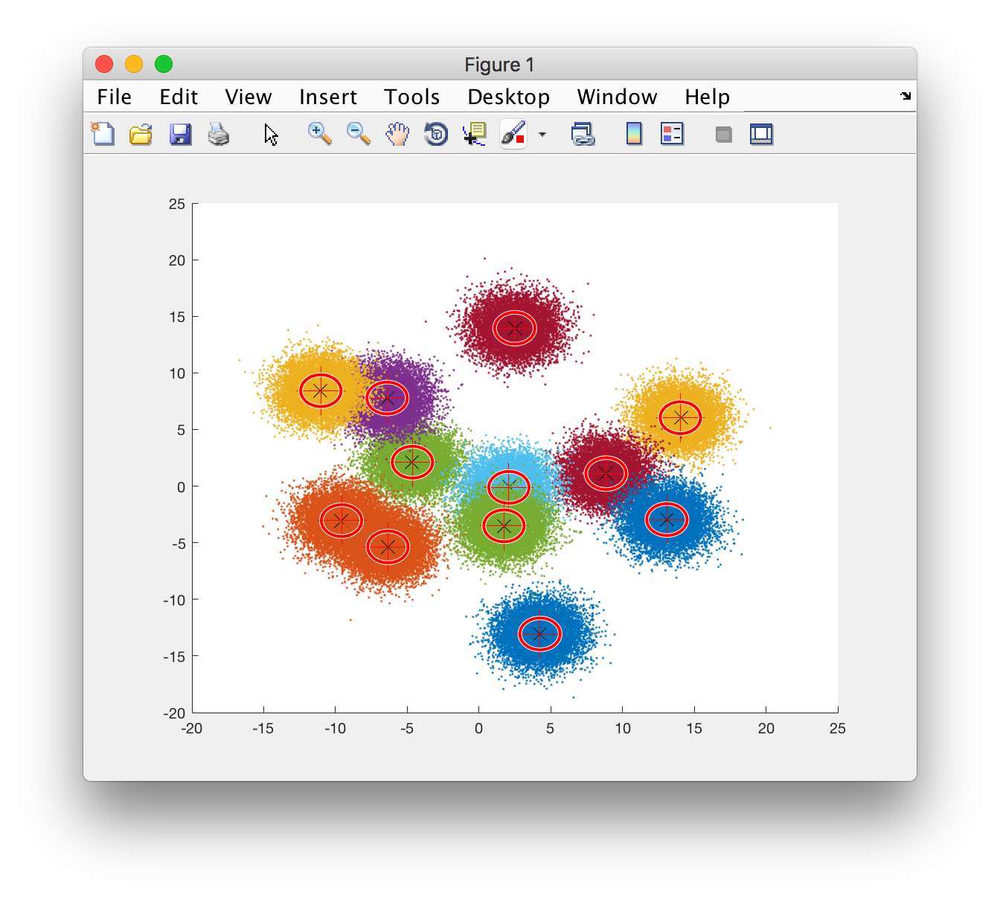
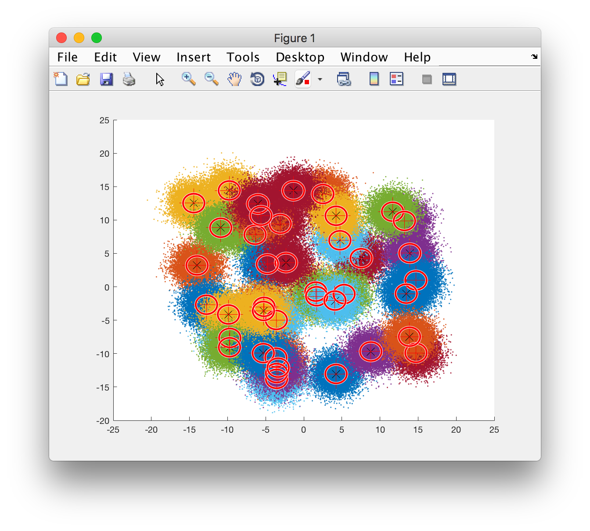
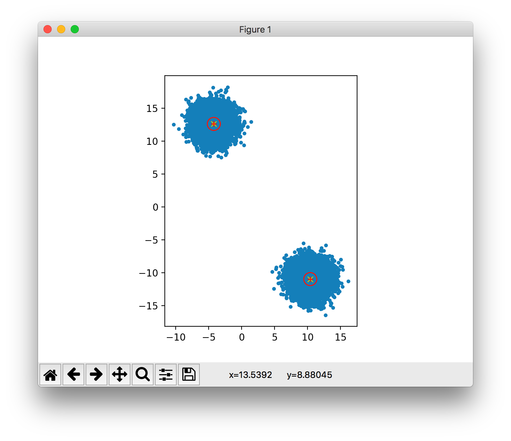
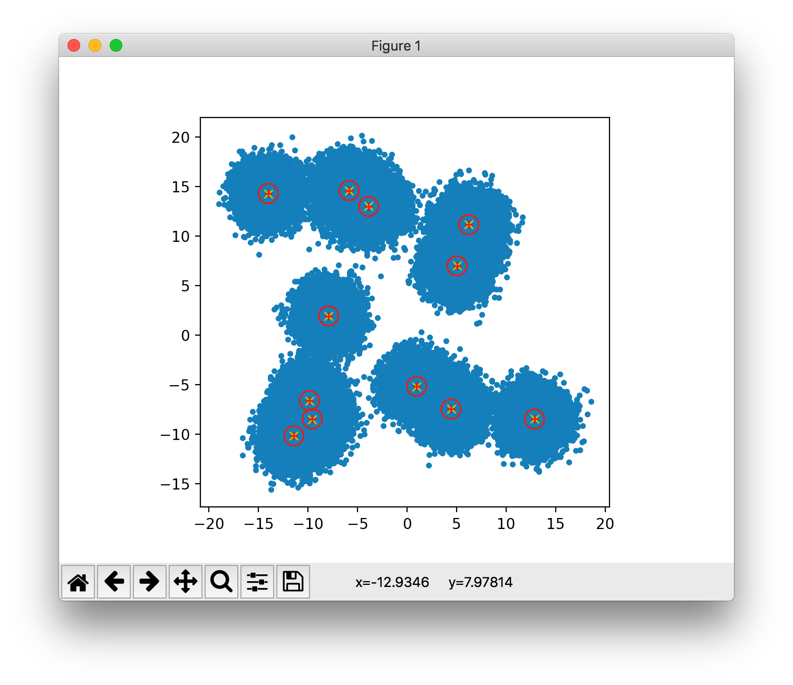

# tensor-gmm
Implementation of learning a Gaussian mixture model using tensor decomposition.

## Matlab sample plots

Shared parameters:
* n = 10000
* s = 2
* dist = 15
* spher = 1

#### Plot 1

* d = 3
* k = 2

#### Plot 2

* d = 20
* k = 12

#### Plot 3

* d = 50
* k = 40

## Python sample plots

Shared parameters:
* n = 10000
* s = 2
* dist = 15
* spher = 1

#### Plot 1

* d = 3
* k = 2

#### Plot 2

* d = 20
* k = 12

